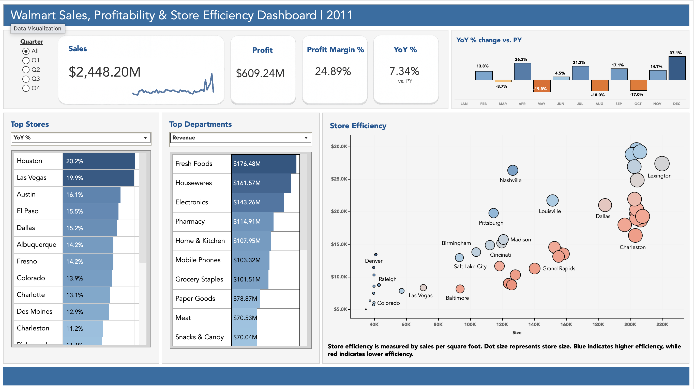

# Walmart Retail Sales Performance Analysis

## Project Overview

This project analyzes Walmart retail sales data to identify store performance patterns, department-level trends, sales efficiency, profitability, markdown impact, and holiday demand behavior.

The goal of the project is to answer a practical business question:

**Which stores, departments, and time periods drive the strongest sales and profitability, and where are there signs of underperformance?**

## Business Problem

Retail businesses need to understand which stores and departments generate the most value, how seasonal and holiday periods affect demand, and whether promotional markdowns improve sales performance. This analysis uses SQL and Tableau to evaluate store-level performance, sales efficiency, profitability, and operational trends.

## Tools Used

- PostgreSQL
- SQL
- VS Code
- Tableau Public
- GitHub

## Dataset

The dataset contains weekly Walmart sales records across multiple stores and departments. Fields include store number, department, store type, store size, date, weekly sales, holiday flag, temperature, fuel price, CPI, unemployment, markdowns, estimated profit, COGS, and profit margin.

## Key Business Questions

1. Which stores and departments generate the most sales?
2. Which stores are most efficient based on sales per square foot?
3. Are high-sales stores also high-profit stores?
4. How do holidays affect sales performance?
5. Do markdowns appear to improve sales or profitability?
6. Which stores show signs of underperformance?

## Repository Structure

sql/
  01_create_table.sql
  02_sales_performance.sql
  03_store_efficiency.sql
  04_profitability_analysis.sql
  05_markdown_holiday_analysis.sql
  06_dashboard_views.sql

images/
  Tableau dashboard screenshots and visual exports

exports/
  Tableau-ready CSV exports

notes/
  Portfolio draft notes and project planning

data/
  Walmart sales dataset

## Analysis Sections

### 1. Sales Performance Overview

This section establishes the overall size, sales performance, time range, store mix, and high-level revenue patterns in the dataset.

#### Key Sales Performance Findings

- The dataset contains **421,570 weekly sales records** across **45 stores** and **81 departments**.
- The date range runs from **February 5, 2010** through **October 26, 2012**.
- Total sales were **$6.74 billion**, with estimated profit of **$1.49 billion**.
- Average estimated profit margin across records was **20.77%**.
- 2011 had the highest total sales at **$2.45 billion**, while 2012 should be interpreted as a partial year because the data ends in October.
- July had the highest total monthly sales at **$650.00 million**, while December had the highest average weekly sales per record at **$19,355.70**.
- Store Type A generated the most total sales at **$4.33 billion** and had the highest average weekly sales per record.
- Store 20 had the highest total sales at **$301.40 million**.
- Store 10, a Type B store, stood out as a strong efficiency performer with **$2,146.97 sales per square foot**.
- Store 29 appeared to be a potential underperformer because it had a larger footprint but relatively low sales per square foot.

#### Sales Performance Takeaway

The sales performance overview showed that total revenue alone does not fully explain store performance. Larger Type A stores dominate sales volume, but efficiency metrics such as sales per square foot reveal additional insights into which stores may be outperforming or underperforming relative to their size.

### 2. Store Efficiency

This section evaluates store performance relative to physical footprint using sales per square foot and profit per square foot.

#### Key Store Efficiency Findings

- Average sales per square foot across all stores were **$1,214.19**.
- Sales efficiency ranged from **$618.19** to **$2,205.58** per square foot.
- Average profit per square foot was **$272.61**.
- Store 43, a Type C store, had the highest sales efficiency at **$2,205.58 sales per square foot**.
- Store 43 also had the highest profit efficiency at **$554.27 profit per square foot**.
- Store 10, a Type B store, was a strong performer because it ranked highly in both total sales and sales per square foot.
- High-efficiency stores averaged **$1,990.36 sales per square foot**.
- Low-efficiency stores averaged only **$768.90 sales per square foot**.
- High-efficiency stores generated roughly **2.59x more sales per square foot** than low-efficiency stores.
- Several large stores appeared in the low-efficiency group, including Store 32 and Store 28, suggesting possible underperformance relative to physical footprint.

#### Store Efficiency Takeaway

Store efficiency analysis showed that larger stores are not always the strongest performers once store size is considered. Type A stores dominated total sales, but several Type B and Type C stores outperformed on sales per square foot. This suggests that store performance should be evaluated using both revenue and efficiency metrics.

### 3. Profitability Analysis

This section analyzes total profit, profit margin, department profitability, and profit per square foot.

#### Key Profitability Findings

- Total estimated profit was **$1.49 billion**.
- Overall profit margin was **22.07%**.
- Store 20 had the highest estimated profit at **$68.38 million**.
- The top stores by total profit were mostly large Type A stores.
- Store 10 stood out because it combined high total sales with strong profit efficiency, generating **$460.32 profit per square foot**.
- Department 92 generated the highest estimated profit at **$136.79 million**.
- Department 91 had the highest profit margin among meaningful-volume departments at **30.80%**.
- Store 43 had the highest profit per square foot at **$554.27**.
- Store 9 had the lowest profit per square foot at **$133.83**.
- High profit-efficiency stores averaged **$472.99 profit per square foot**, while low profit-efficiency stores averaged **$155.77**.
- High profit-efficiency stores generated roughly **3.04x more profit per square foot** than low profit-efficiency stores.

#### Profitability Takeaway

The profitability analysis showed that total profit is strongly related to sales volume, but profit margin and profit per square foot reveal more nuanced performance differences. Large Type A stores dominate total profit, while smaller Type B and Type C stores can outperform on profit efficiency.

### 4. Markdown and Holiday Impact

This section analyzes how holiday weeks and markdown activity relate to sales, profit, and margin performance.

#### Key Markdown and Holiday Findings

- Holiday weeks had higher average weekly sales per record at **$17,035.82**, compared to **$15,901.45** for non-holiday weeks.
- Holiday weeks had much higher average markdown activity at **$15,729.58** per record, compared to **$5,999.44** during non-holiday weeks.
- Holiday profit margin was lower at **19.86%**, compared to **22.25%** for non-holiday weeks.
- High-markdown records had the highest average weekly sales at **$19,971.10**.
- High-markdown records had the lowest profit margin at **7.55%**.
- No-markdown records had a much stronger profit margin of **27.82%**.
- High-markdown holiday records had an especially low profit margin of **6.45%**.
- Markdown activity had only a weak positive correlation with weekly sales (**0.0652**).
- Markdown activity had a stronger negative correlation with profit margin (**-0.5750**).

#### Markdown and Holiday Takeaway

Holiday periods and markdown-heavy records were associated with higher sales intensity, but markdown activity substantially reduced margin performance. This suggests markdown strategy should be evaluated by profit and margin impact rather than sales lift alone.

### 5. Recommendations

This section translates the analysis into business recommendations focused on store performance, efficiency, profitability, and markdown strategy.

#### Key Recommendations

- **Evaluate stores using both total sales and efficiency metrics.** Total sales alone can be misleading because larger stores naturally generate more revenue. Sales per square foot and profit per square foot provide a more balanced view of performance.
- **Review large low-efficiency stores for possible underperformance.** Stores such as Store 32, Store 28, and Store 9 should be reviewed for possible issues related to market demand, department mix, staffing, layout, or promotional effectiveness.
- **Use high-efficiency stores as performance benchmarks.** Store 43, Store 10, Store 42, Store 37, and Store 23 were strong performers based on sales per square foot.
- **Protect high-profit and high-margin departments.** Department 92 was the strongest total profit driver, while Department 91 had the highest margin among meaningful-volume departments.
- **Reevaluate markdown strategy using margin impact, not sales lift alone.** Markdown activity had only a weak positive correlation with weekly sales but a stronger negative correlation with profit margin.
- **Plan holiday promotions around profitability.** Holiday weeks had higher average sales but lower profit margins, especially when markdown activity was high.

#### Recommendation Takeaway

The analysis suggests that retail performance should be evaluated through a combination of sales volume, space efficiency, profit margin, and promotion impact. Larger stores drive total sales, but smaller stores can outperform on efficiency. Markdown and holiday strategies should be judged by profitability, not sales lift alone.

## Tableau Dashboard

The Tableau dashboard summarizes Walmart retail sales, profitability, store efficiency, department performance, and markdown/holiday impact.

The dashboard focuses on:

- Sales and profit KPI performance
- Year-over-year sales trends
- Top departments by sales or profit
- Top stores by selected performance metric
- Store efficiency based on store size and sales performance
- Markdown and promotion impact on profitability

[View the Tableau Public Dashboard](https://public.tableau.com/app/profile/anton.jackson3576/viz/Walmartdashboard_17726474850320/Dashboard1)

Portfolio Case Study

To be completed.

Author

Anton Jackson